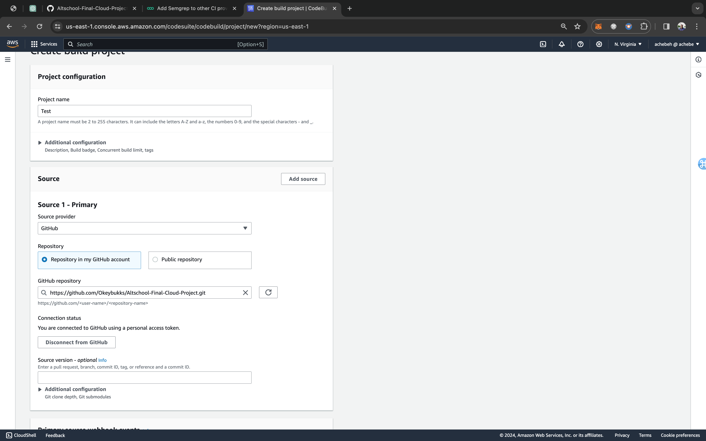
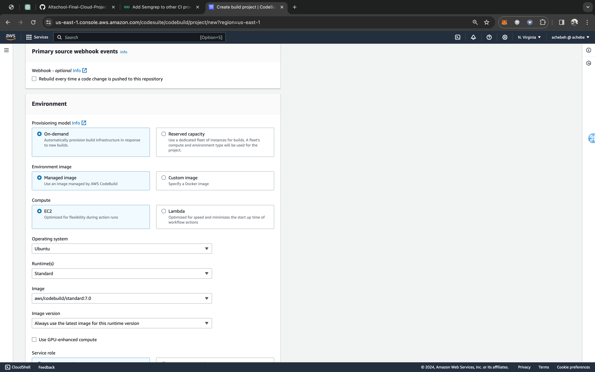
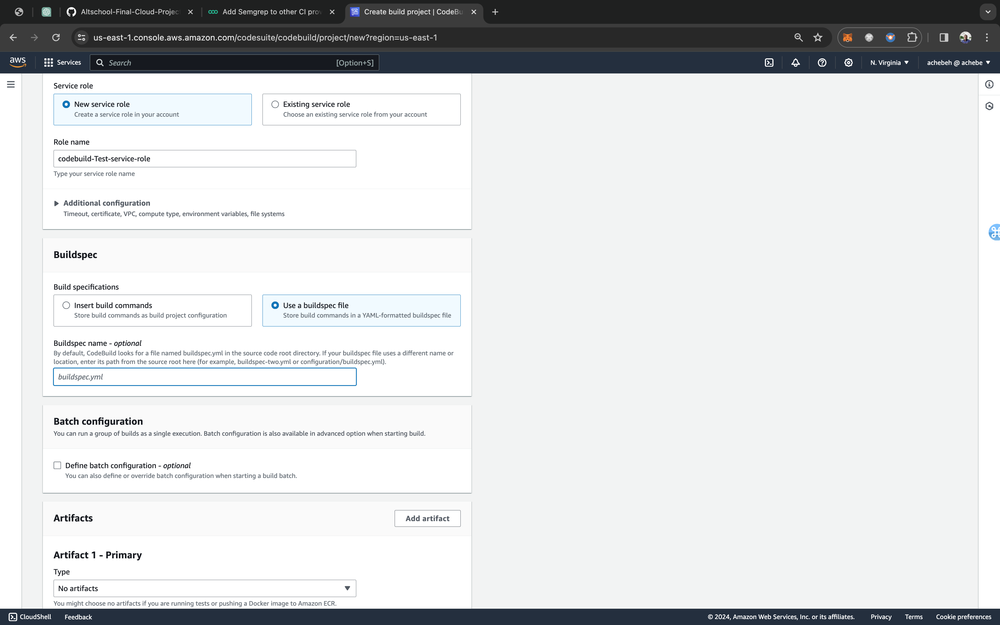
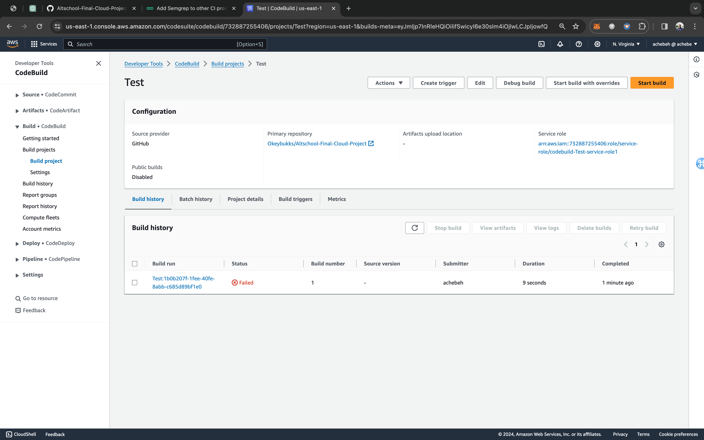
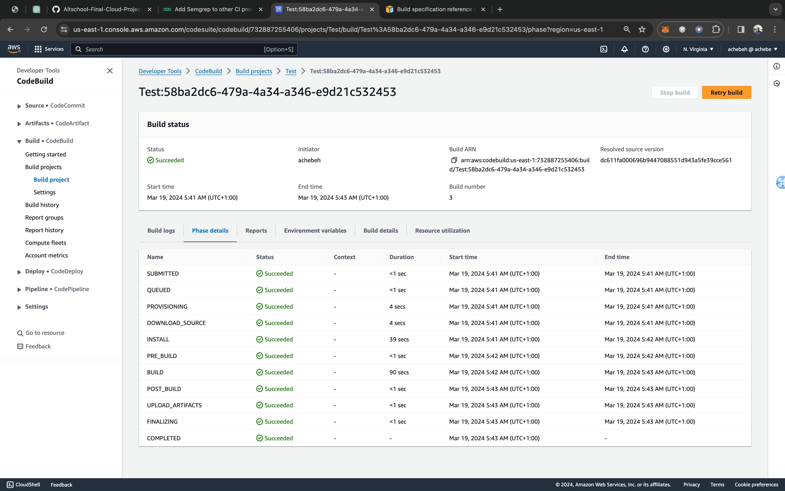
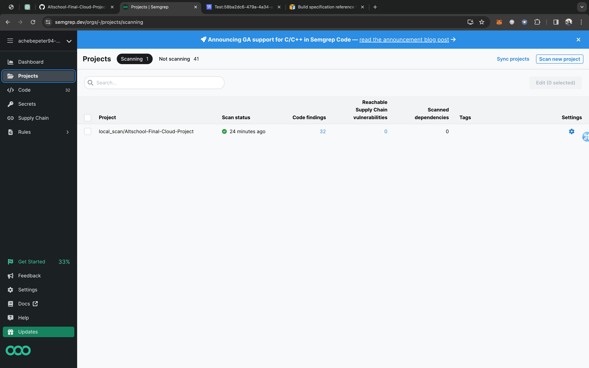
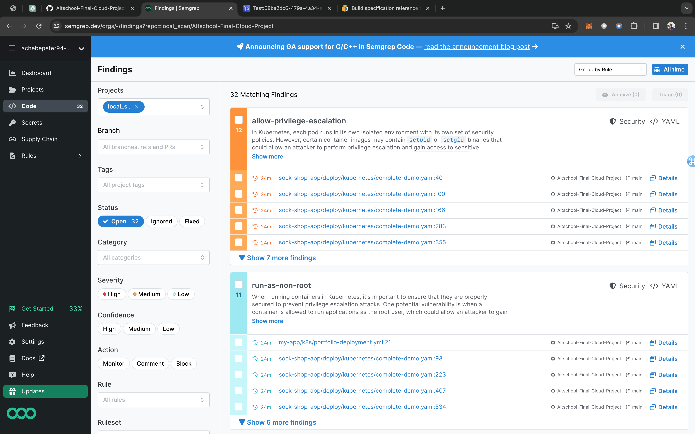
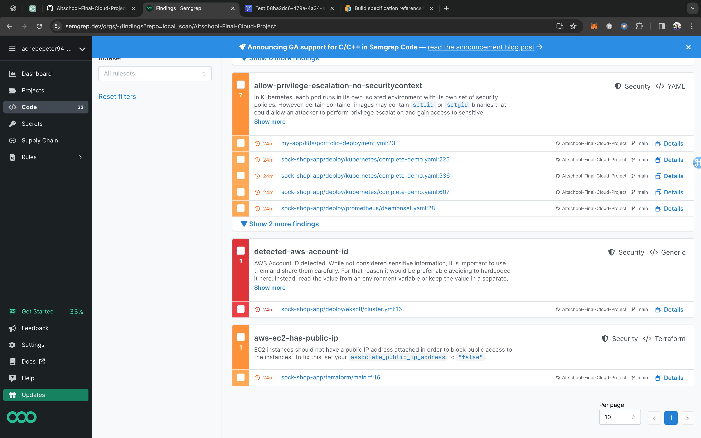

# Implementing Semgrep with AWS CodeBuild
This documentation provides a guide to integrating Semgrep to AWS CloudBuild

## Prerequisite
1. An AWS Account
2. A Semgrep Account

## Usage
1. Create a `buildspec.yaml` file in the root directory of the repository to be scanned by Semgrep
2. Create an AWS CodeBuild Project which links to the repository containing the `buildspec.yaml` file then click on build. 

## Setting Up Semgrep
Refer to Semgrep's documentation for instructions on setting up an account. You can access it [here](https://semgrep.dev/docs/deployment/create-account-and-orgs/).

Semgrep conducts scanning through a Semgrep CI job integrated into your pipeline. This job requires minimal configuration. To ensure the scan report reaches the Semgrep Project Dashboard, create a `SEMGREP_APP_TOKEN` and insert the following code block into your `buildspec.yaml` file.
```
version: 0.2

env:
  secrets-manager:
    SEMGREP_APP_TOKEN: "semgrep_token:SEMGREP_APP_TOKEN"
phases:
  install:
    runtime-versions:
      python: 3.8
    commands:
      - pip3 install semgrep
  build:
    commands:    
      - semgrep ci
```
The Semgrep [doc](https://semgrep.dev/docs/deployment/add-semgrep-to-other-ci-providers/#create-a-semgrep_app_token) provides a good guide to create your `SEMGREP_APP_TOKEN`.

## Setting Up AWS CodeBuild
1. Login into your AWS Account, search for the AWS CodeBuild Resource and then select it.
2. Click on Create Project
3. Input project name.

    
4. Click on Source Provider and select `GitHub`
5. Select Repository in my Github Account. You will have to generate a GitHub token and add to the token space given to have access to your repositories. 
5. Select the repository that contains the `buildspec.yaml` file.
6. For the Environment, I used Ubuntu as the operating system. You can leave the other default values.

    
7. Select New service role, the default service role name is sufficient.

    
8. Select Use a buildspec file for the Build specification.
9. Untick the CloudWatch logs option. For production you might want to tick this box.
10. Click on create project.

## Running a Build.
As it is now, when the build is triggered manually it fails with this error.

```
Secrets Manager Error: AccessDeniedException: User: arn:aws:sts::************:assumed-role/codebuild-Test-service-role1/AWSCodeBuild-1b0b207f-1fee-40fe-8abb-c685d89bf1e0 is not authorized to perform: secretsmanager:GetSecretValue on resource: semgrep_token because no identity-based policy allows the secretsmanager:GetSecretValue action status code: 400, request id: 3132ffcd-48f3-46d1-8a65-2769d3dc4ed1
```



The reason for this is the role that was created during the build configuration doesn't have the necessary permission to get the `SEMGREP_APP_TOKEN` stored in Secret Manager.

The `SEMGREP_APP_TOKEN` for this demo is stored in AWS Secret Manager. This [doc](https://docs.aws.amazon.com/codebuild/latest/userguide/build-spec-ref.html#build-spec-ref-syntax) provides a good guide on how to access secrets stored in AWS Secret Manager with AWS CloudBuild.

To grant the created role the necessary permissions to access the stored secret, navigate to the Secret Manager and locate the stored secret. In the Overview Tab, select Resource permissions, and then click on "Edit" to add the permission allowing Cloud Build to access the secret. Insert the following code block:

 ```
 {
  "Version" : "2012-10-17",
  "Statement" : [ {
    "Effect" : "Allow",
    "Principal" : {
      "AWS" : "arn:aws:iam::************:role/service-role/codebuild-test-service-role"
    },
    "Action" : "secretsmanager:GetSecretValue",
    "Resource" : "*"
  } ]
}
 ```
The `************` is your AWS account ID. Be certain to pass the ARN of the cloud build to the `AWS` key in the permission json.

With the permission set, you can trigger the build again and it will run.



Below are screenshots of the build history and the scan done on the repository with the report sent to the Semgrep Console.






